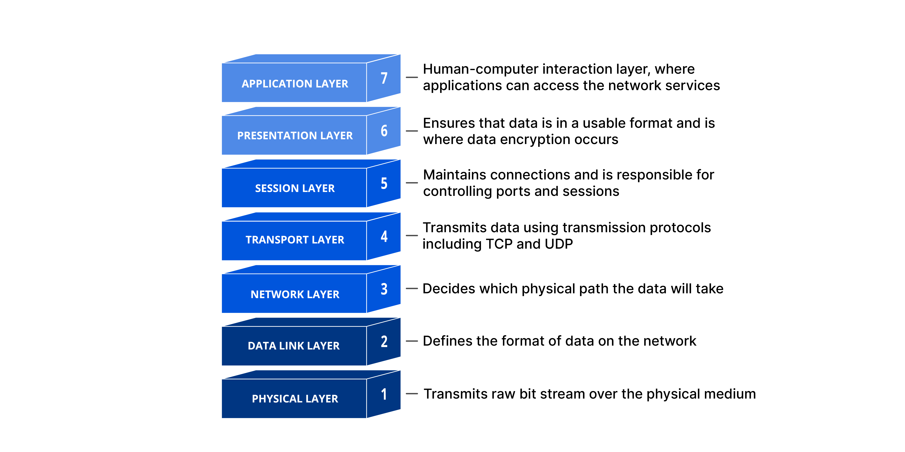
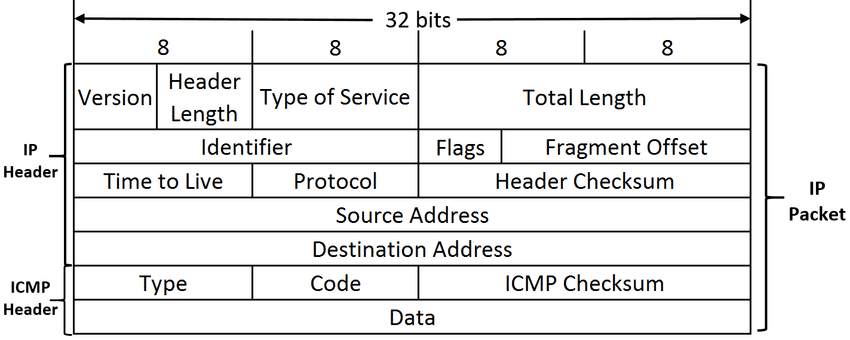

# ft_traceroute

A low-level network path analysis tool recoded in C, reproducing the operational behavior of standard UNIX `traceroute`. The program maps intermediate hops across an IP network by systematically incrementing the Time-to-Live (TTL) field of outgoing network probes and capturing ICMP diagnostic responses via raw POSIX sockets.

---

## 📌 Technical Scope & Subject Requirements

* **Reference Standard**: Re-implementation of classic POSIX route tracing mechanisms with exact output layout and indentation matching standard system `traceroute`.
* **Addressing & Resolution**:

  * Full IPv4 address and hostname support via standard resolution interfaces (`getaddrinfo`).
  * FQDN resolution handling for input parameters without performing DNS reverse lookup on intermediary hop displays (unless specified).
* **CLI Interface**: Strict argument handling supporting single-target tracing and the mandatory `--help` usage flag.
* **Socket Architecture & Constraints**:

  * Standard C library (`libc`) networking primitives exclusively.
  * Direct packet manipulation bypassing external system utilities or shell execution.
  * **Strict Constraint**: Socket operations must remain blocking (`O_NONBLOCK` is explicitly disallowed). Packet timeouts and wait cycles are governed by socket-level options (`SO_RCVTIMEO`) or explicit I/O multiplexing (`select`).
* **Robustness & Defensive Programming**: Complete absence of memory leaks, zero-crash tolerance on malformed or unexpected ingress packets, and safe shutdown on interruptions.
* No bonus features were implemented.

---

## 📐 Architecture & Core Concepts

### 1. Hop-by-Hop Route Discovery (TTL Expiration Mechanism)

`ft_traceroute` leverages the Time-to-Live (TTL) header field to force intermediary gateways along the network path to drop packets and return diagnostic telemetry.



1. **Probe Transmission**: Sets an initial `IP_TTL = 1` using `setsockopt(..., IPPROTO_IP, IP_TTL, ...)` and transmits 3 probe packets per hop toward the target destination.
2. **Intermediate Hop Detection**: The router at the current hop decrements the TTL to 0, drops the datagram, and returns an `ICMP Type 11` (**Time-to-Live Exceeded in Transit**) back to the host.
3. **Target Reachability**: Once the destination host is reached, an `ICMP Type 3, Code 3` (**Destination Unreachable - Port Unreachable**) or standard ICMP Echo Reply is triggered, signaling the completion of the route trace.
4. **TTL Incrementation**: The TTL counter is incremented sequentially (`TTL = 2, 3, ...`) until the target responds or the maximum hop threshold (default: 30) is reached.

### 2. Packet Architecture & RTT Profiling

Each probe sequence transmits multiple attempts per hop to measure latency variance and identify packet drop rates.



* **Round-Trip Time (RTT)**: Latency is computed per attempt with microsecond resolution:
  \(\Delta t = t_{\text{ICMP\_received}} - t_{\text{probe\_sent}}\)
* **Timeout Governance**: Non-responsive intermediate hops are captured deterministically using `*` placeholders after configurable timeout deadlines.
* **Packet Demultiplexing**: Ingress ICMP payloads are stripped down to their embedded IP/transport headers to correlate incoming error reports with their originating process port and sequence ID.

---

## 🛠️ Build & Usage

### Prerequisites

* Linux environment (Kernel $\ge 4.0$, Debian-compatible).
* Standard C toolchain (`gcc` or `clang`, `make`).
* sudo permissions

### Compilation

```bash
make
```

### Clean

```bash
make fclean
```

### Execution

Raw socket binding and packet sniffing require root privileges (CAP_NET_RAW / sudo):

```bash
# Display help and supported parameters
./ft_traceroute --help

# Trace route to an IPv4 host
sudo ./ft_traceroute 8.8.8.8

# Trace route using an FQDN target
sudo ./ft_traceroute slashdot.org
```

### Expected result

```bash
$ make
gcc -Wall -Wextra -Werror -c ft_traceroute.c -o ft_traceroute.o
gcc -Wall -Wextra -Werror -c utils.c -o utils.o
gcc -Wall -Wextra -Werror -c parser.c -o parser.o
gcc -Wall -Wextra -Werror -c send.c -o send.o
gcc -Wall -Wextra -Werror -c receive.c -o receive.o
gcc -Wall -Wextra -Werror -o ft_traceroute ft_traceroute.o utils.o parser.o send.o receive.o -lm
ft_traceroute created.

$ ./ft_traceroute --help
Usage:
  ft_traceroute <host>

Options:
  --help        Read this help and exit
Arguments:
  <host>        The host to traceroute to (IP address or hostname)

$ sudo ./ft_traceroute 8.8.8.8
ft_traceroute to 8.8.8.8 (8.8.8.8), 30 hops max, 60 byte packets
 1  gateway.local (192.168.1.1)  0.498 ms  0.491 ms  0.362 ms
 2  10.0.0.1 (10.0.0.1)  2.255 ms  2.564 ms  7.267 ms
 3  10.0.6.153 (10.0.6.153)  3.996 ms  5.189 ms  4.262 ms
 4  172.16.52.17 (172.16.52.17)  6.872 ms  6.586 ms  6.556 ms
 5  * * *
 6  10.220.109.62 (10.220.109.62)  12.234 ms  7.344 ms  7.711 ms
 7  10.221.219.44 (10.221.219.44)  7.791 ms  8.410 ms  7.447 ms
 8  * * *
 9  86-120-71-209.rdsnet.ro (86.120.71.209)  8.079 ms  8.143 ms  8.197 ms
10  142.250.61.41 (142.250.61.41)  7.080 ms  7.381 ms  8.294 ms
11  142.250.232.11 (142.250.232.11)  8.034 ms  8.770 ms  7.779 ms
12  dns.google (8.8.8.8)  9.299 ms  7.638 ms  9.037 ms

$ sudo ./ft_traceroute slashdot.org
ft_traceroute to slashdot.org (104.18.5.215), 30 hops max, 60 byte packets
 1  gateway.local (192.168.1.1)  0.649 ms  0.570 ms  0.614 ms
 2  10.0.0.1 (10.0.0.1)  5.443 ms  2.460 ms  2.487 ms
 3  10.0.6.153 (10.0.6.153)  5.729 ms  6.004 ms  4.917 ms
 4  172.16.52.17 (172.16.52.17)  7.041 ms  5.761 ms  7.129 ms
 5  * * *
 6  10.220.109.62 (10.220.109.62)  7.898 ms  8.277 ms  7.646 ms
 7  86-120-71-220.rdsnet.ro (86.120.71.220)  8.174 ms  8.550 ms  8.942 ms
 8  cloudflare.baja.espanix.net (193.149.1.56)  8.394 ms  7.794 ms  8.913 ms
 9  * * *
10  188.114.108.21 (188.114.108.21)  10.242 ms  9.424 ms  11.922 ms
11  104.18.5.215 (104.18.5.215)  10.291 ms  9.022 ms  12.140 ms
```

## 🧪 Verification & Defensive Engineering

**Blocking Socket Timeout Verification**: Validated socket responsiveness against non-routable addresses without relying on O_NONBLOCK.

**Memory & Resource Sanitation**: Fully verified via valgrind --leak-check=full --track-origins=yes ensuring 0 memory leaks across normal runs, unreachable host paths, and premature SIGINT terminations.

**Network Tolerance**: Verified consistent parsing against corrupted headers, misaligned payloads, and asymmetric routing delays.
